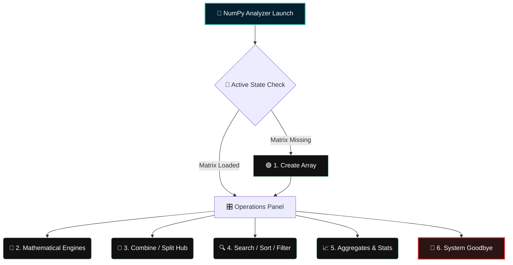

# Analyzer
# 🧮 NumPy Analyzer

<div align="center">
  <!-- Native Embedded CSS Typographic Card -->
  <div style="background: linear-gradient(135deg, #012030 0%, #13678A 100%); padding: 30px; border-radius: 12px; box-shadow: 0 4px 15px rgba(0,0,0,0.3); border: 2px solid #45C4B0; max-width: 600px; margin: 20px auto;">
    <h1 style="color: #9AE6B4; margin: 0 0 10px 0; font-family: 'Fira Code', monospace; font-size: 28px; text-shadow: 0 0 10px rgba(154,230,180,0.3);">NumPy Analyzer CLI</h1>
    <p style="color: #E2E8F0; margin: 0; font-family: system-ui, sans-serif; font-size: 15px; line-height: 1.5;">
      An interactive Matrix Processing Suite. Compute advanced vector mathematics, statistical distributions, and array transformations natively inside your console shell.
    </p>
    <div style="margin-top: 15px; display: inline-block; font-family: 'Fira Code', monospace; color: #45C4B0; font-size: 13px; background: rgba(0,0,0,0.2); padding: 5px 15px; border-radius: 20px; border: 1px solid rgba(69,196,176,0.3);">
      ⚡ Status: Fully Operational
    </div>
  </div>
</div>

---

## 🛠️ Main Features Breakdown

Open individual categories below to look closer into specific execution options:

<details open>
<summary><b>📐 1. N-Dimensional Array Factory</b></summary>
<br>

* 🧊 **D-Type Architectures:** Instantiate native 1D vectors, 2D planes, or complex multi-layer 3D arrays.
* 🔪 **Slicing Engine:** Extract deep matrix views and subarrays dynamically via explicit index coordinate strings (`:`, `0:2, 1:3`).
* 🎯 **Point Indexing:** Isolate raw data scalar components along localized axes effortlessly.
</details>

<details>
<summary><b>📈 2. Mathematical Operations Engine</b></summary>
<br>

* ➕ **Element-Wise Math:** Compute addition, subtraction, division, and element multiplication across twin matrices in linear steps.
* ✖️ **Dot & Cross Products:** Perform 1D vector scaling computations or fully optimized `np.matmul` configurations for 2D spaces.
</details>

<details>
<summary><b>🧬 3. Reshaping, Combining, & Splitting</b></summary>
<br>

* 🧱 **Vertical Stacking:** Append dimensional matrices seamlessly using vertical stack mapping rules.
* ✂️ **Axis Dissection:** Slice an active array into cleanly balanced, matching scalar chunks across custom rows or columns.
</details>

<details>
<summary><b>📊 4. Structural Search, Sort, & Filter</b></summary>
<br>

* 🔍 **Index Coordinate Query:** Find coordinates of exact matching numbers inside any dimensional space using `np.argwhere`.
* 🌪️ **Axis-Bound Sort:** Sort arrays down a single row axis, column axis, or flat arrays.
* 📉 **Conditional Masks:** Filter out numbers matching custom logical condition bounds.
</details>

<details>
<summary><b>📉 5. Statistical & Aggregate Operations</b></summary>
<br>

* 🧮 **Core Aggregates:** Pull Sum, Mean, Median, Min, and Max from a active dataset in a single call.
* 📉 **Variance Analysis:** Calculate precise Standard Deviation (σ) and Variance metrics.
* 📈 **Advanced Distribution:** Locate custom Percentile cutoffs or track multi-dimensional Correlation Matrix blocks.
</details>

---

## 🗺️ Live Workflow Architecture



---

## 🚀 Initialization Prerequisites

### Runtime Checklist
* **Environment:** Python 3.8+ or higher.
* **External Core Library:** requires `numpy` package installed to handle calculations.
  ```bash
  pip install numpy
  ```

### Run Command
```bash
python numpy_analyzer.py
```

---

## 📝 Sample Console Output Logs

```text
==========================================
           NUMPY ANALYZER
==========================================
Choose an option:
1. Create a Numpy Array
2. Perform Mathematical Operations
...
Array created successfully:
[[ 10  30  50]
 [ 70  90 110]]

Sliced Array:
[[ 30  50]
 [ 90 110]]

Result of Addition:
[[ 13  36  54]
 [ 77  98 114]]

Combined Array (Vertical Stack):
[[ 10  30  50]
 [ 70  90 110]
 [  4   5   6]
 [  7   8   9]]

Standard Deviation of Array: 34.15650255319866
==========================================
Thank you for using the NumPy Analyzer! Goodbye!
```

---

<!-- Premium Safe Markdown UI Custom Styles Component -->
<style>
  summary {
    font-size: 1.1rem;
    padding: 14px;
    background: #0d1117;
    border-radius: 8px;
    margin-bottom: 10px;
    cursor: pointer;
    border-left: 4px solid #45C4B0;
    transition: all 0.2s ease-in-out;
    list-style: none;
    font-family: system-ui, sans-serif;
    color: #c9d1d9;
  }
  summary:hover {
    background: #161b22;
    transform: translateX(4px);
    color: #58a6ff;
  }
  summary::-webkit-details-marker {
    display: none;
  }
</style>
